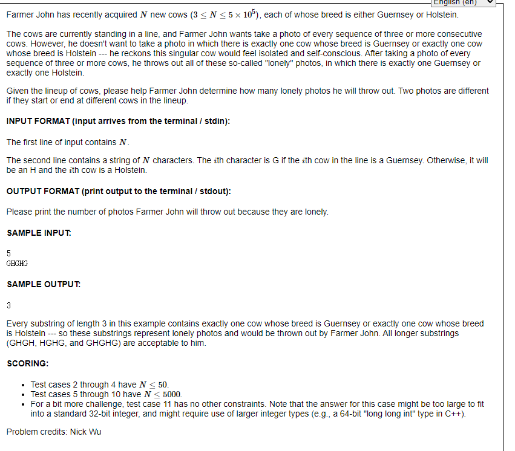
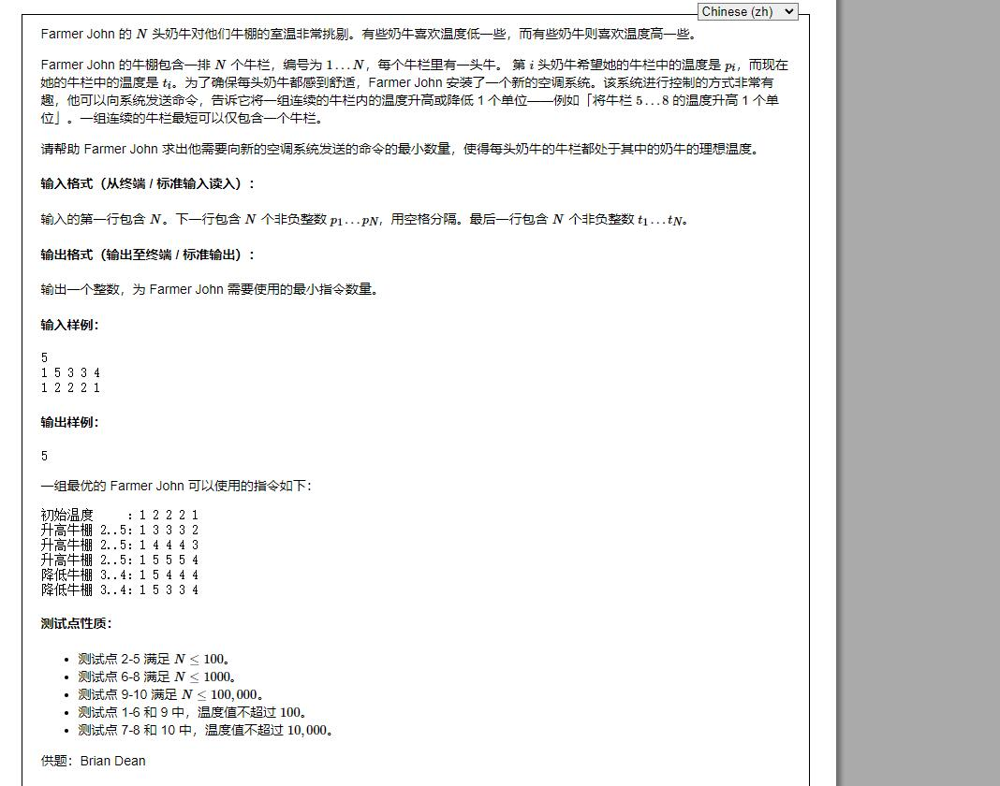
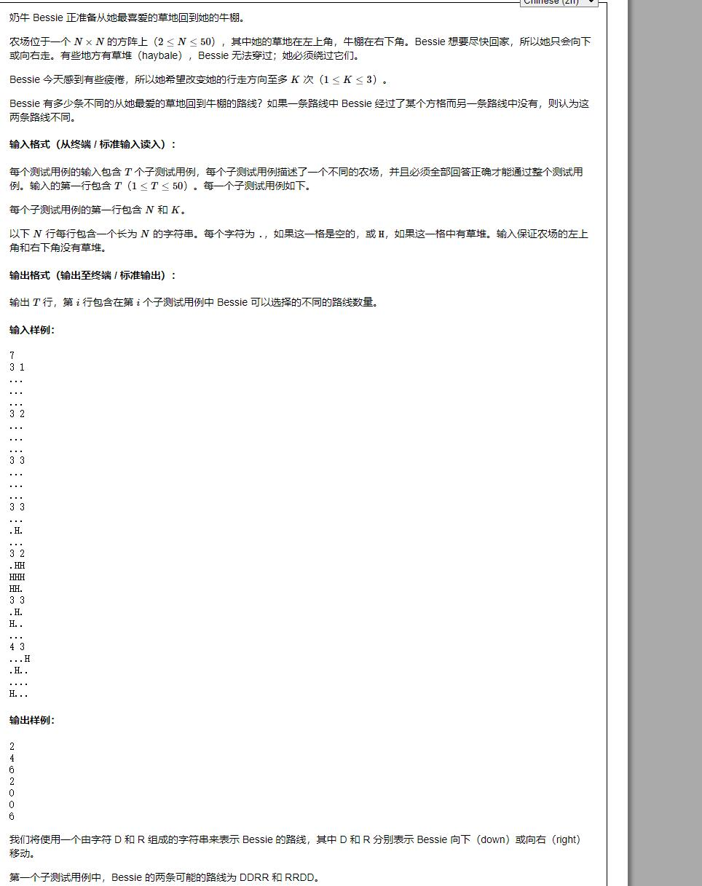
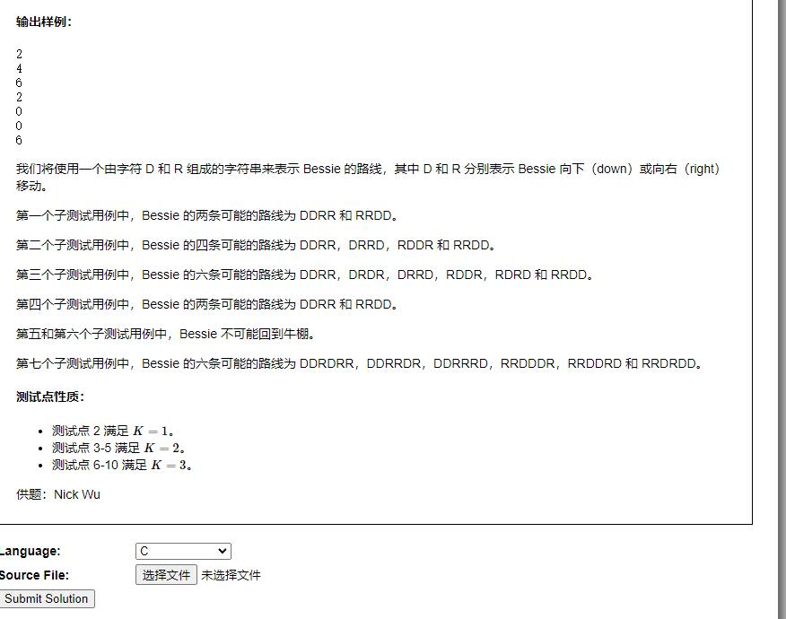

# USACO 2021.12 Bronze

## T1 Lonely Photo

题解：

### 暴力

大模拟，见 [lonely-photo.cpp](lonely-photo.cpp)

### 正解

不失一般性，考虑每个 G (或每个 H)

	G H H ... H G H H ... H G

如果该 G 所在的某张照片是孤独的，且左边有 m 个 H，右面有 n 个 H，则有如下三种情况：
* 全都是左边的 H，m - 1
* 全都是右边的 H，n - 1
* 两边的 H 都有，m * n

加法原理，m + n + m * n - 2

对于 corner case 读者留作读者思考。

见 [lonely-photo-v2.cpp](lonely-photo-v2.cpp)

## T2 Air Conditioning

不难，NOIP 2018 D1T1，铺设道路。贪心，只不过这里要把正负分开讨论罢了。

留作读者思考。

见 [air-conditioning.cpp](air-conditioning.cpp)

## T3 Walking Home

对于 k = 1 与 k = 2 都不难，非常简单。我们这里思考 k = 3 的情况。显然：这里我们需要用 dp，建立状态方程：

	f[i][j][k][0] 表示到达 (i, j)，已经转了 k 次方向，现在的方向是向右 
	f[i][j][k][1] 表示到达 (i, j)，已经转了 k 次方向，现在的方向是向下

下面是递推关系：

	f[i][j][k][0] = f[i - 1][j][k][0] + f[i - 1][j][k - 1][1] 
	f[i][j][k][1] = f[i][j - 1][k][1] + f[i][j - 1][k - 1][0]

注意：
1. 对于每个式子的第二项，k > 0
2. (1, 2) 和 (2, 1) 不得有第二项，因为刚刚出发是不可能通过转向得来的

最终的结果留给读者思考。代码中 k = 2 也用了 dp，理由是懒得多写。

见 [walking-home.cpp](walking-home.cpp)
